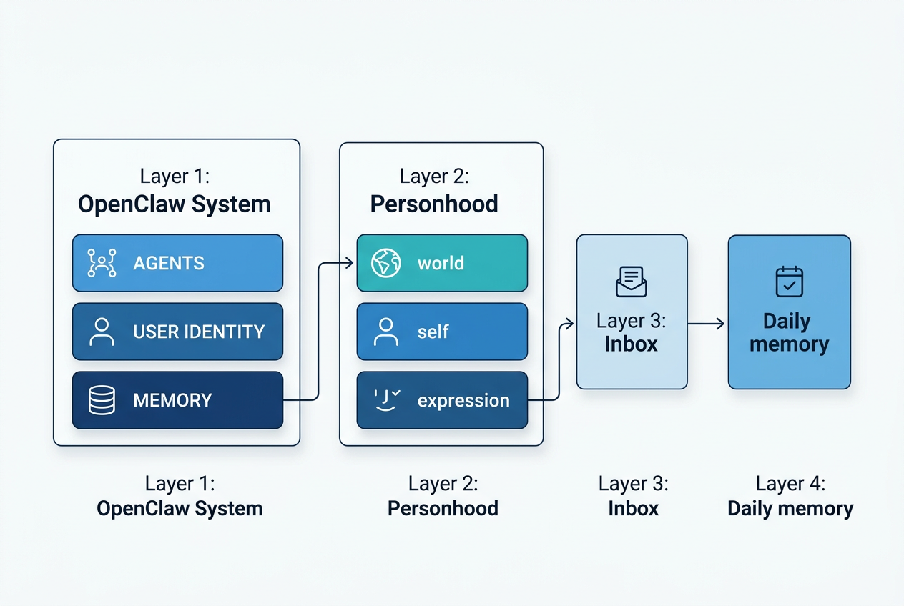

# OpenClaw Agent Bootstrap Kit

通用智能体启动包 — 一键完成新智能体全套初始化。

包含记忆体系、人格文档、通用技能、安全体系、定时任务，让新智能体开箱即用。



## 功能

| 模块 | 说明 |
|------|------|
| **人格文档** | SOUL.md / AGENTS.md / IDENTITY.md / HEARTBEAT.md |
| **记忆系统** | 四层记忆体系（daily log / MEMORY.md / projects / inbox） |
| **通用技能** | 20+ 个 skill（安全系 + 通用系） |
| **安全体系** | 四层防御（卫士虾 + clawdefender + skill-vetter） |
| **定时任务** | 日蒸馏 + 周提升，槽位自动错开 |

## 快速开始

### 新建智能体

```bash
# 1. 创建 workspace
openclaw agents add <agent_id>

# 2. 运行 bootstrap kit
bash install.sh <agent_id> --name <名字>
```

### 修复已有智能体

```bash
bash install.sh <agent_id> --repair
```

### 验证状态

```bash
bash install.sh <agent_id> --verify
```

## cron 槽位时间表

**日蒸馏（每日）：**
- 槽位 0 → 08:10
- 槽位 1 → 10:25
- 槽位 2 → 14:40
- 槽位 3 → 21:55

**周提升（周日）：**
- 槽位 0 → 周日 02:00
- 槽位 1 → 周日 02:20
- 槽位 2 → 周日 02:40
- 槽位 3 → 周日 03:00

## 目录结构

```
openclaw-personhood-system/
├── install.sh              # 主安装脚本
├── SKILL.md               # OpenClaw skill 定义
├── README.md
├── LICENSE
├── config/
│   └── agent-cron-map.json  # cron 槽位分配表
├── scripts/
│   └── install.sh          # 核心安装脚本
├── templates/
│   ├── personality/         # 人格文档模板
│   ├── memory/              # 记忆文件模板
│   ├── security/            # 安全体系说明
│   └── cron/                # cron 模板
├── docs/
│   └── SPEC.md              # 完整规格说明书
└── skills/                  # 可选 skill 清单
```

## 技能清单（自动安装）

**安全系（essential）：**
`tuanziguardianclaw` · `clawdefender` · `skill-vetter` · `openclaw-memory-maintainer` · `proactive-agent-lite` · `self-improving` · `find-skills`

**通用系：**
`web_search` · `openclaw-minimax-router` · `image-generation` · `social-content` · `brainstorming` · `pinchtab-browser` · `feishu-*` · `github` · `gmail`

## 安全体系

```
第一层：tuanziguardianclaw（卫士虾核心内核）
  └─ 监控/拦截所有危险操作，Skill 沙箱

第二层：clawdefender（输入扫描器）
  └─ 检测注入/泄露/路径遍历

第三层：skill-vetter（技能安装审查）
  └─ 新 skill 安装前安全审查

第四层：security-auditor + healthcheck（可选）
  └─ 代码审计 + 主机加固
```

## 文件覆盖规则

| 文件 | 已有时 | 不存在时 |
|------|--------|---------|
| IDENTITY.md / USER.md / MEMORY.md | 不覆盖 | 创建 |
| memory/*.md | 不覆盖 | 创建 |
| bootstrap.done | 覆盖 | 创建 |
| skills/ | 已有软链接跳过 | 创建软链接 |

## 与 agent-creator 的关系

```
agent-creator（官方流程） → bootstrap-kit（深度配置）
         ↓
   创建 workspace
         ↓
   运行 bootstrap-kit
         ↓
   一键完成：记忆+人格+技能+安全+cron
```

## 升级

```bash
cd openclaw-personhood-system
git pull origin main
```

---
License: MIT
