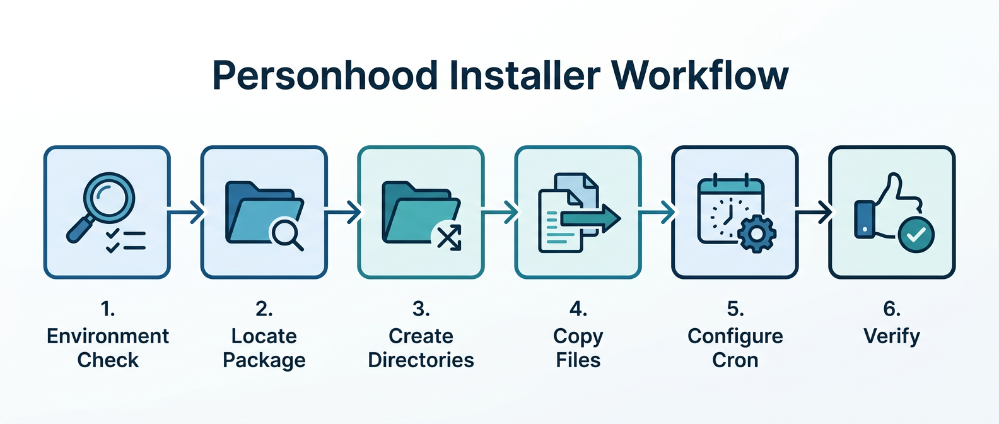
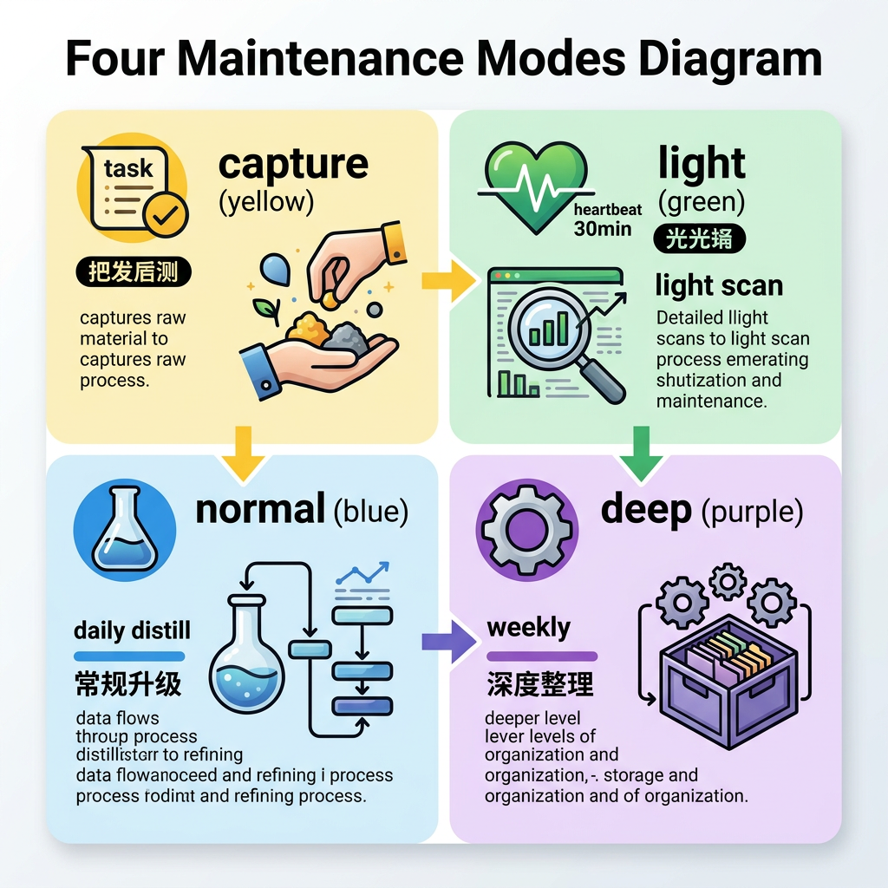

# OpenClaw Personhood System

A portable, installable personhood and long-term cognition layer for OpenClaw agents.

It helps an agent become more stable, more self-consistent, and more human over time by separating what should live in top-level memory, what belongs to world knowledge, what belongs to self-knowledge, and what should stay as unverified raw material.


## What This Package Solves

Most agent workspaces eventually hit the same problems:

- daily memory keeps growing, but no one distills it
- stable rules, persona knowledge, and temporary observations get mixed together
- the agent remembers many things, but still does not feel more coherent
- after upgrades or workspace rebuilds, the hand-maintained memory structure is easy to lose

This package turns that mess into a layered, recoverable system.

## Core Idea

Instead of stuffing everything into `MEMORY.md`, this package adds three extra long-term layers plus an inbox layer:

- `memory/world.md` - stable external-world cognition
- `memory/self.md` - stable self-knowledge about recurring strengths, risks, and growth direction
- `memory/expression.md` - stable expression and tone-control rules
- `memory/inbox/` - unverified cognition candidates that should not be promoted too early

These layers work together with the existing OpenClaw files:

- `AGENTS.md`
- `USER.md`
- `IDENTITY.md`
- `MEMORY.md`
- `memory/YYYY-MM-DD.md`

## How It Works



The package installs two core skills:

### `personhood-installer`

A one-shot installation entry for setting up the system in a target OpenClaw workspace.

### `personhood-document-maintainer`

The maintenance skill that keeps the layered documents clean over time.

It supports four maintenance modes:



| Mode | Typical trigger | Goal |
|------|------------------|------|
| `capture` | after high-cognition tasks | leave raw material in daily memory or inbox |
| `light` | heartbeat | do lightweight scanning and small corrections |
| `normal` | daily distill | promote stable insights and clean document boundaries |
| `deep` | weekly evolution | deeper cleanup, merge, downgrade, and long-term restructuring |

## Installation

```bash
git clone https://github.com/DwDestiny/openclaw-personhood-system.git
cd openclaw-personhood-system
./install.sh --agent mia
```

Before installing, read `docs/pre-install-checklist.md`.

## Install Options

```bash
./install.sh --agent <agent-name> [options]

Options:
  --agent <name>      target agent (required)
  --workspace <path>  target workspace path
  --dry-run           preview only, do not write files
  --force             overwrite existing files
  --skip-cron         skip cron setup file generation
  --verbose           print more details
  --uninstall         remove the installed package files
```

## Cron Design

The package is designed to work with three recurring jobs:

| Job | Schedule | Purpose |
|-----|----------|---------|
| daily distill | every day 23:30 | normal document maintenance |
| self evolution | Sunday 02:00 | deep personhood cleanup |
| capability evolver | Sunday 02:20 | separate weekly capability review |

This keeps personhood maintenance and capability evolution related but separate.

## Repository Guide

- `install.sh` - installation and uninstall entry
- `manifest.json` - package metadata
- `skills/personhood-installer/` - installer skill
- `skills/personhood-document-maintainer/` - document maintainer skill
- `templates/` - initial layered memory files
- `docs/` - methodology, architecture, hooks, cron plan, and maintenance rules
- `assets/images/` - diagrams used in the README

## Documentation Map

- `docs/overview.md` - high-level overview
- `docs/installable-package-design.md` - why this is packaged instead of patching core prompts
- `docs/document-maintenance-methodology.md` - maintenance methodology
- `docs/document-maintenance-skill-spec.md` - skill design spec
- `docs/pre-hook-methodology.md` - when to hook before task execution
- `docs/post-hook-methodology.md` - how to decide `capture` / `light` / `normal` / `deep`
- `docs/capture-hook-selection-rules.md` - task selection rules for capture
- `docs/cron-hooking-plan.md` - cron wiring plan
- `docs/weekly-evolution-and-skill-improvement.md` - separation of personhood evolution and capability evolution

## Compatibility

- OpenClaw 0.9.0+
- supports `mia`, `main`, `eric`, `elena`, or custom agents
- works on top of OpenClaw heartbeat, memory search, session-memory, and cron

## Why It Matters

A lot of agent systems remember more over time, but do not actually become better organized.

This package is meant to solve that specific gap:

- not just more memory
- but better memory boundaries
- not just more notes
- but a maintainable personhood architecture
- not just one workspace hack
- but a reusable public package

## License

This repository currently inherits the surrounding project usage model. Add a dedicated license file if you want to publish it under an explicit OSS license.
